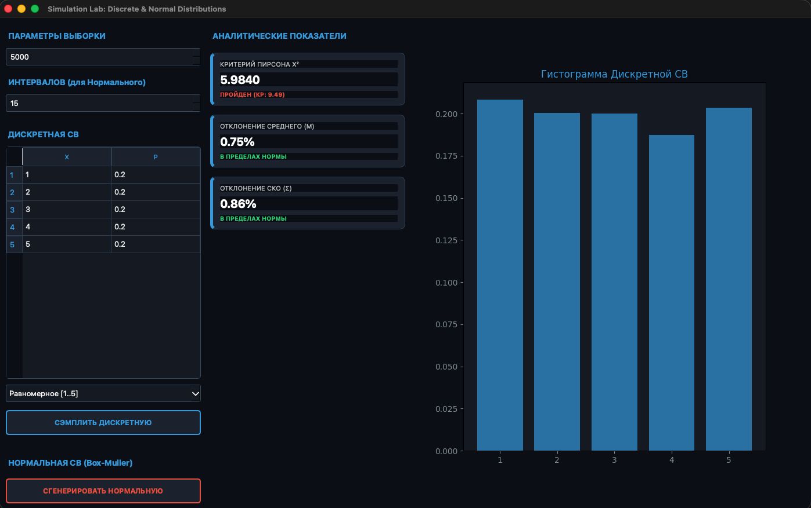
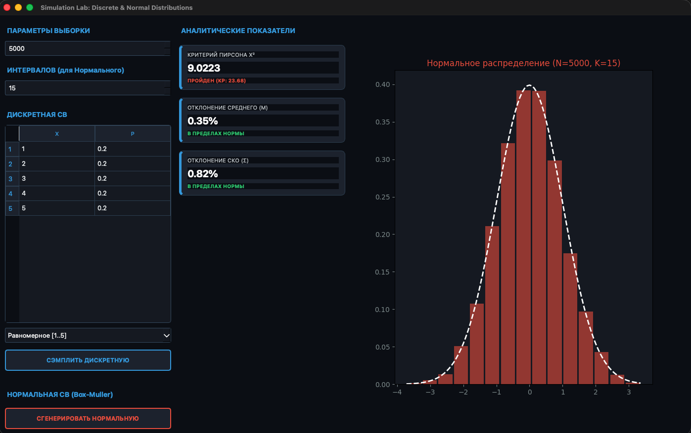

### Имитационное моделирование дискретных случайных величин

**Задание:**
- реализовать генерацию дискретной случайной величины, заданной рядом распределения;
	- вычислить эмпирические вероятности;
	- вычислить выборочные среднее и дисперсию, их относительные погрешности;
	- вычислить статистику χ² и применить критерий χ² при:
	  - N = 10, 100, 1 000, 10 000;
- Реализовать генератор нормальной случайной величины, 
	- построить гистограммы 
	- сравнить точность моделирования при разных объёмах выборки.
- сделать вывод.
# Сравнение точности для дискретной СВ

| Размер выборки N \ Критерий | $$\chi^2$$ | Относительное отклонение среднего, % | Относительное отклонение стандартного отклонения, % |
|:-------------------------------------------|:-----:|:------:|:-------:|
| **10** | 5.116 | 0.07 | 1.13 |
| **100** | 0.8 | 1 | 2.3 |
| **1000** | 0.58 | 0.67 | 0.71 |
| **10000** | 0.295 | 0.17 | 0.12 |

# Сравнение точности для нормально распределенной случайной величины
| Размер выборки N \ Критерий | $$\chi^2$$ | Относительное отклонение среднего, % | Относительное отклонение стандартного отклонения, % |
|:-------------------------------------------|:-----:|:------:|:-------:|
| **10** | 13.45 | 1.54 | 0.38 |
| **100** | 8.29 | 2.48 | 0.87 |
| **1000** | 9.9359 | 4.15 | 3.48 |
| **10000** | 3.4814 | 0.32 | 0.25 |

